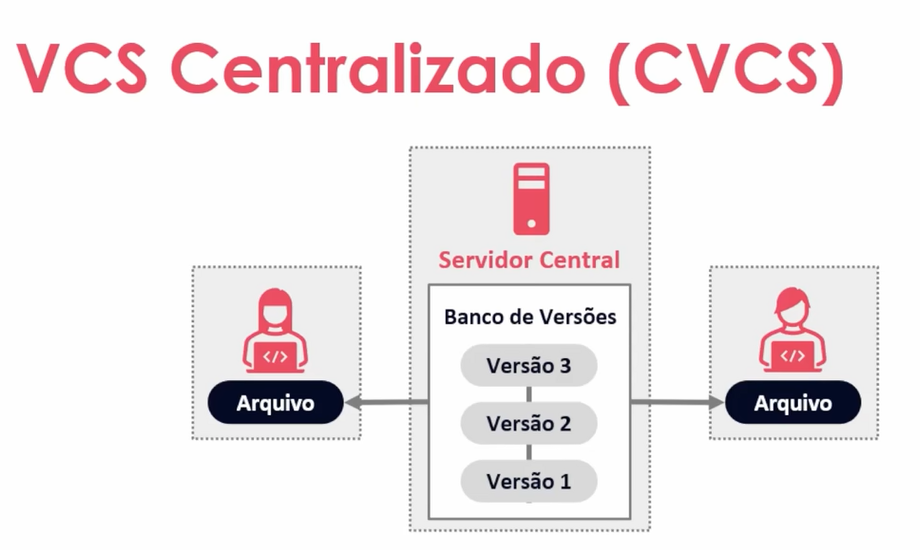
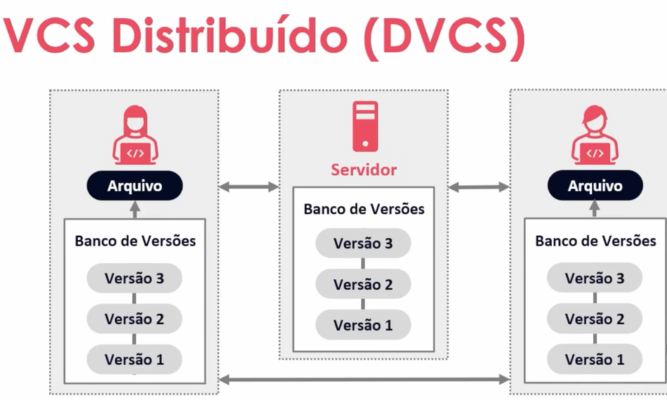

# Versionamento de Código com git e github

Versionamento de código é a prática de gerenciar as alterações feitas em arquivos de código-fonte ao longo do tempo

## Sistemas de Controle de Versão 

- Controlam as versões de um arquivo ao longo do tempo. 
- Registra o histórico de atualizações de um arquivo; 
- Gerencia quais foram as alterações, a data, autor, etc.; 
- Organização, controle e segurança.

## Tipos se sistemas de controle de versionamento

- Centralizado: um sistema de controle de versionamento centralizado (CVCS) é uma ferramenta que armazena todas as versões de um arquivo em um único servidor. Ele é usado para registrar alterações feitas em arquivos de código-fonte ao longo do tempo. 
O CVCS é uma forma de gerenciar alterações de forma simples e direta. Ele permite que as equipes de desenvolvimento de software colaborem usando um servidor central. 

    - CVS
    - Subversion

- Distribuido: um sistema de controle de versão distribuído descentraliza o processo de gerenciamento de projetos, passando de um único repositório ou servidor central para um modelo onde cada membro da equipe tem uma cópia completa de todo o projeto no repositório local.

    - git
    - Mercurial

# Atalho para abrir o vscode do github

- clique na tecla `.` 

# Materiais Complementares
 
Nossos materiais complementares e de apoio têm como objetivo apresentar informações para facilitar e enriquecer a sua jornada de aprendizado. Para isso, links úteis (como slides, repositórios e páginas oficiais) serão disponibilizados, além de dicas sobre como se destacar na DIO e no mercado de trabalho 😉
 
Repositório Git
 
O Git é um conceito essencial no mercado de trabalho atualmente, por isso sempre reforçamos sua importância em nossa metodologia educacional. Por isso, todo código-fonte desenvolvido durante este conteúdo foi versionado no seguinte endereço para que você possa consultá-lo a qualquer momento:
 
https://github.com/elidianaandrade/dio-curso-git-github
 
Slides
Versionamento de Código com Git e GitHub.pptx
 
Dicas/Links Úteis
 
Por fim, disponibilizamos alguns links úteis para que você possa se desenvolver ainda mais através de referências oficiais das tecnologias, páginas de documentação e/ou fóruns de discussão relevantes. Nesse contexto, seguem algumas sugestões:
 
Artigos/Fórum: você pode compartilhar conteúdos técnicos através de Artigos (visíveis globalmente na plataforma da DIO). Por outro lado, você também pode compartilhar suas conquistas e dúvidas usando os Fóruns (que são específicos para cada experiência educacional na DIO, como um Bootcamp por exemplo);
Rooms: caso você esteja inscrito(a) em uma experiência educacional na DIO (como um Bootcamp, por exemplo) você terá acesso ao Rooms. O Rooms é uma ferramenta de bate-papo em tempo real onde todos os inscritos podem interagir, compartilhando dúvidas e dicas (que podem conter imagens e snippets de código-fonte);
Pesquise na Web: pode parecer óbvio, mas é importante frisar a importância das engines de busca no dia-a-dia de um profissional de TI. Caso não encontre o que procura dentro da DIO, pesquise sobre o assunto (conceito, dúvida, erro etc) na Internet (dê um Google), pois na maioria das vezes você será levado à páginas incríveis como o StackOverflow que salvarão o seu dia 😎