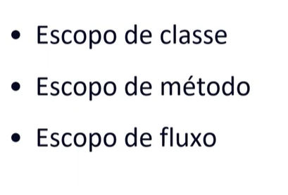
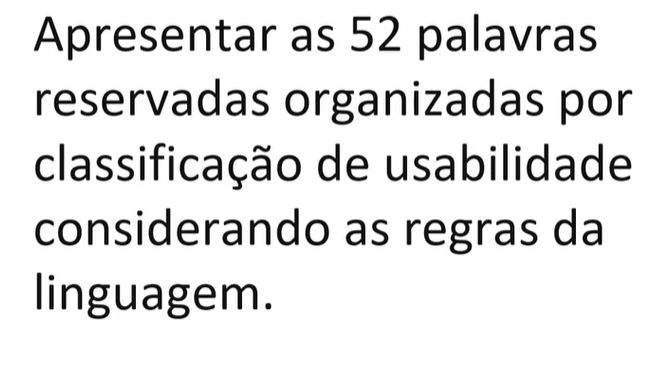
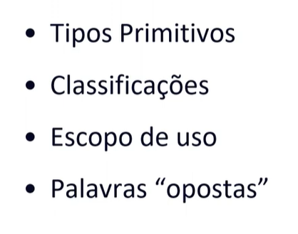
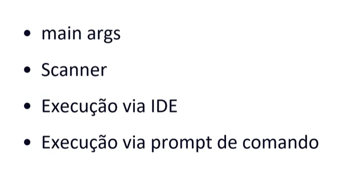

# Java Basico

- Indrodção
  
  

  

- Anatomia das classes

- Tipos e varíaveis

    - boolean: Só pode conter valores de verdade, "true" ou "false". 
    - int: O tipo de dado mais usado para números inteiros. 
    - float: É usado para números decimais. 
    - char: Contém um caractere único, marcado entre aspas simples. 
    - byte: Tem um tamanho de 8 bits e um valor que varia de -128 a 127. 
    - short: Tem um tamanho de 16 bits e um valor que varia de -32.768 a 32.767. 
    - long: Tem um tamanho de 64 bits. 
    - double: Representa números de ponto flutuante de precisão dupla (64 bits). 

- Operadores
- Métodos

- Escopo

O escopo pode ser entendido como o ambiente onde uma variável pode ser acessada. Em Java, o escopo de variáveis vai de acordo com o bloco onde ela foi declarada.

- Palavras reservadas

Todas essas palavras são:

1. abstract - Define uma classe ou método abstrato que não pode ser instanciado diretamente.
2. assert - Utilizado para fazer afirmações no código, útil para testes e depuração.
3. boolean - Define um tipo de dado booleano que pode ser true ou false.
4. break - Interrompe o fluxo de um loop ou switch.
5. byte - Define um tipo de dado de 8 bits.
6. case - Define um bloco de código em um switch.
7. catch - Captura exceções geradas em um bloco try.
8. char - Define um tipo de dado de caractere de 16 bits.
9. class - Define uma classe.
10. const - Reservada, mas não utilizada.
11. continue - Continua a próxima iteração de um loop.
12. default - Define o bloco padrão em um switch.
13. do - Utilizado em loops do-while.
14. double - Define um tipo de dado de ponto flutuante de 64 bits.
15. else - Define um bloco de código alternativo em um if.
16. enum - Define um tipo enumerado.
17. extends - Indica que uma classe herda de outra classe.
18. final - Define constantes, classes que não podem ser estendidas, e métodos que não podem ser sobrescritos.
19. finally - Define um bloco de código que sempre é executado após um try-catch.
20. float - Define um tipo de dado de ponto flutuante de 32 bits.
21. for - Utilizado para loops for.
22. goto - Reservada, mas não utilizada.
23. if - Define uma condição.
24. implements - Indica que uma classe implementa uma interface.
25. import - Importa pacotes ou classes.
26. instanceof - Verifica se um objeto é uma instância de uma classe específica.
27. int - Define um tipo de dado inteiro de 32 bits.
28. interface - Define uma interface.
29. long - Define um tipo de dado inteiro de 64 bits.
30. native - Indica que um método é implementado em código nativo (fora do Java).
31. new - Cria novas instâncias de objetos.
32. null - Representa uma referência nula.
33. package - Define um pacote.
34. private - Define um membro de classe que só pode ser acessado dentro da própria classe.
35. protected - Define um membro de classe que pode ser acessado dentro do mesmo pacote ou subclasses.
36. public - Define um membro de classe que pode ser acessado de qualquer lugar.
37. return - Retorna um valor de um método.
38. short - Define um tipo de dado inteiro de 16 bits.
39. static - Define membros de classe que pertencem à classe, e não a instâncias.
40. strictfp - Restringe a precisão e arredondamento de operações de ponto flutuante.
41. super - Refere-se à superclasse imediata.
42. switch - Define um bloco de código que será executado com base no valor de uma expressão.
43. synchronized - Indica que um método ou bloco de código é sincronizado.
44. this - Refere-se à instância atual da classe.
45. throw - Lança uma exceção.
46. throws - Declara que um método pode lançar exceções.
47. transient - Indica que um campo não deve ser serializado.
48. try - Define um bloco de código que será testado para exceções.
49. void - Indica que um método não retorna nenhum valor.
50. volatile - Indica que um campo pode ser alterado por diferentes threads.
51. while - Utilizado para loops while.
52. true, false, null - Literais reservados que representam valores booleanos e uma referência nula.

- Java Doc

`javadoc -encoding UTF-8 -docencoding ISO-8859-1 -d docs src/*.java`

- Terminal e Argumentos

