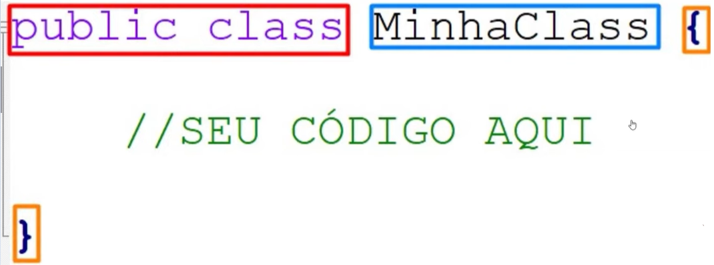

# Java Basico

- Indrodção
  
  

  

- Anatomia das classes

- Tipos e varíaveis

    - boolean: Só pode conter valores de verdade, "true" ou "false". 
    - int: O tipo de dado mais usado para números inteiros. 
    - float: É usado para números decimais. 
    - char: Contém um caractere único, marcado entre aspas simples. 
    - byte: Tem um tamanho de 8 bits e um valor que varia de -128 a 127. 
    - short: Tem um tamanho de 16 bits e um valor que varia de -32.768 a 32.767. 
    - long: Tem um tamanho de 64 bits. 
    - double: Representa números de ponto flutuante de precisão dupla (64 bits). 

- Operadores
- Métodos
- Escopo
- Palavras reservadas
- Java Doc
- Terminal e Argumentos