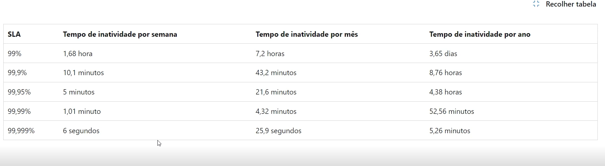

# Tempo de disponibilidade



# Início Rápido: Criar uma máquina virtual do Windows no Portal do Azure

As máquinas virtuais (VM) do Azure podem ser criadas por meio do Portal do Azure. Esse método fornece uma interface de usuário baseada em navegador para criar as VMS seus recursos relacionados. Esse início rápido mostra como usar o portal do Azure para implantar uma máquina virtual (VM) no Azure que executa o Windows Server 2022 Datacenter. Para ver a VM em ação, você habilita o protocolo RDP na VM e instala o servidor Web do IIS.

<a href="https://learn.microsoft.com/pt-br/azure/virtual-machines/windows/quick-create-portal">Saber mais</a>

# Git e GitHub

## O que é Git?
Git é um sistema de controle de versão distribuído que permite rastrear alterações no código-fonte durante o desenvolvimento de software. Ele ajuda equipes a colaborar, gerenciar versões e reverter alterações, se necessário.

## O que é GitHub?
GitHub é uma plataforma baseada na web que utiliza o Git para hospedar repositórios de código. Ele oferece ferramentas para colaboração, revisão de código, integração contínua e muito mais.

## Principais comandos do Git

- **Configuração inicial**:
  ```bash
  git config --global user.name "Seu Nome"
  git config --global user.email "seuemail@example.com"
  ```

- **Criar ou clonar repositórios**:
  ```bash
  git init          # Inicializa um repositório local
  git clone <url>   # Clona um repositório remoto
  ```

- **Rastreamento de alterações**:
  ```bash
  git status        # Mostra o status do repositório
  git add <arquivo> # Adiciona arquivos ao staging
  git commit -m "Mensagem" # Salva alterações no histórico
  ```

- **Sincronização com repositórios remotos**:
  ```bash
  git push          # Envia alterações para o repositório remoto
  git pull          # Atualiza o repositório local com alterações remotas
  git fetch         # Baixa alterações remotas sem mesclá-las
  ```

- **Histórico e revisão**:
  ```bash
  git log           # Exibe o histórico de commits
  git diff          # Mostra diferenças entre versões
  ```

- **Trabalhando com branches**:
  ```bash
  git branch        # Lista branches
  git branch <nome> # Cria um novo branch
  git checkout <nome> # Alterna para outro branch
  git merge <branch>  # Mescla um branch ao atual
  ```

- **Reverter alterações**:
  ```bash
  git reset         # Reverte alterações no staging
  git revert <commit> # Reverte um commit específico
  ```

Para mais informações, consulte a [documentação oficial do Git](https://git-scm.com/doc).

