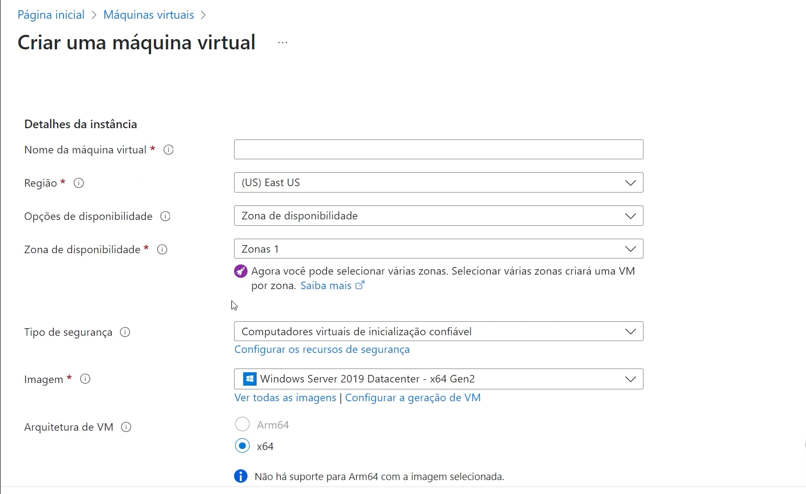
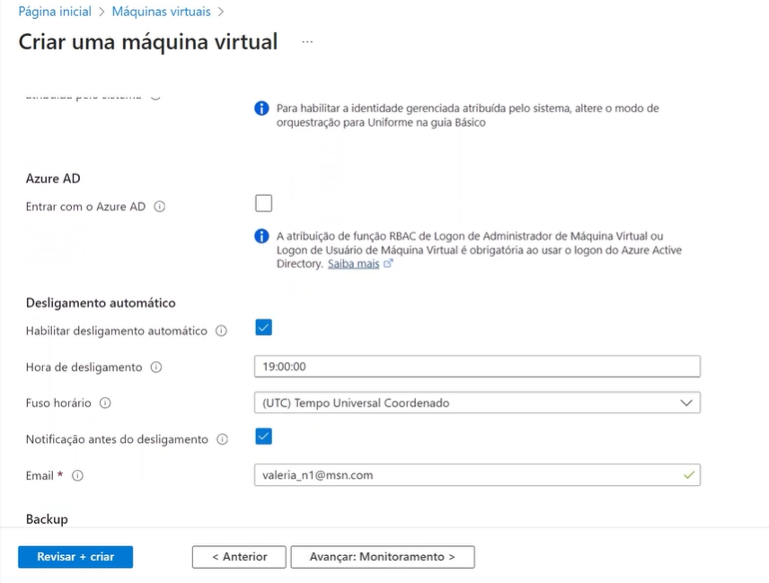
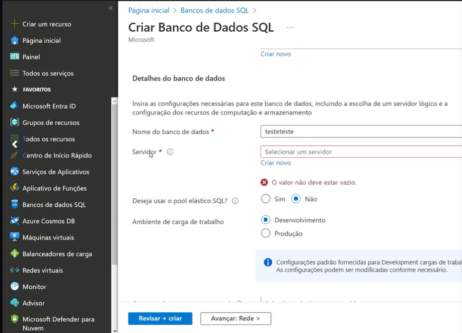
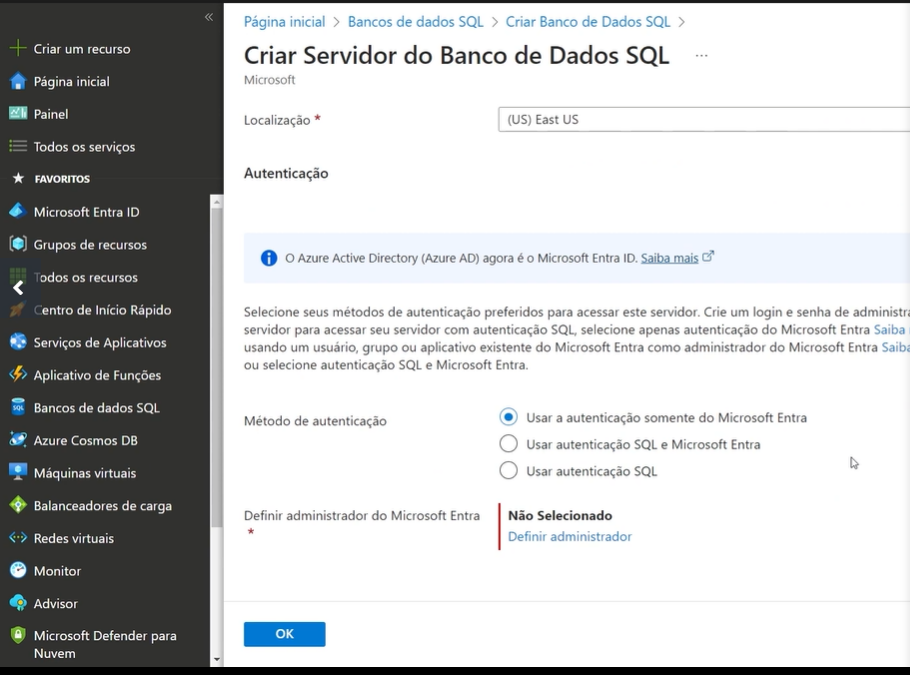

# Passo a passo: Como instanciar um banco de dados no Azure

1. **Acesse o Portal do Azure**  
   Entre no [Portal do Azure](https://portal.azure.com) com sua conta.

2. **Crie um recurso de banco de dados**  
   - Clique em **Criar um recurso** no menu lateral.
   - Pesquise pelo tipo de banco de dados desejado, como "SQL Database" ou "Cosmos DB".
   - Selecione o serviço apropriado e clique em **Criar**.

3. **Configure os detalhes do banco de dados**  
   - Escolha o **Grupo de Recursos** ou crie um novo.
   - Insira o **Nome do Banco de Dados**.
   - Configure o **Servidor** (crie um novo ou selecione um existente).
   - Escolha o **Plano de Preço** ou ajuste conforme necessário.

4. **Configurar autenticação e rede**  
   - Defina o método de autenticação (usuário/senha ou autenticação integrada).
   - Configure as regras de firewall para permitir acesso ao banco de dados.

5. **Revise e crie**  
   - Clique em **Revisar + Criar**.
   - Verifique as configurações e clique em **Criar** para iniciar a implantação.

6. **Acesse o banco de dados**  
   - Após a implantação, vá para o recurso do banco de dados.
   - Use as credenciais configuradas para conectar-se ao banco de dados por meio de ferramentas como o Azure Data Studio, SQL Server Management Studio (SSMS) ou outro cliente.

7. **Gerencie o banco de dados**  
   - Monitore o desempenho, ajuste configurações e gerencie backups diretamente no portal.

Para mais informações, consulte a [documentação oficial do Azure](https://learn.microsoft.com/pt-br/azure/azure-sql/database/single-database-create-quickstart?view=azuresql&tabs=azure-portal).

