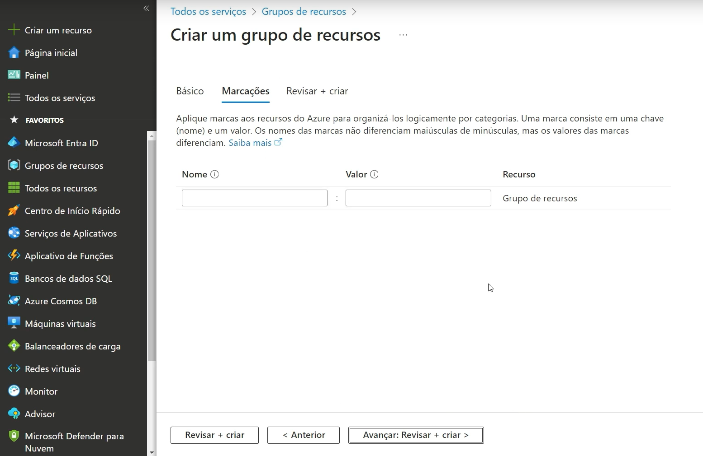

# Sites importantes

- <a href="https://azure.microsoft.com/en-us/explore/global-infrastructure"> Azure Gloabl infrastructure</a>

- <a href="https://datacenters.microsoft.com/globe/explore/">Microsoft Datacenters</a>

# Fazer uma visita virtual 

# Criar recuros

- Clieque em grupo de recursos

- Clieque em `Criar`

Deve chegar nesta tela 

- Nome seu grupo de recursos, na imagem foi colocado o nome de `AZ-900-Lab-DIO`

- Apos escolha a sua regio, ou deixe a padrão que já esta.
- Em seguinte clique em "Avançar", para chegar nesta tela.

Essa parte serve para você ter um controle de qual recurso uso o que, assim quando for pagar você vai saber quem uso o que. Não é obrigatorio.

- Clique em avançar

- Revise e clique em Criar para fazer a criação do seu recurso

Com isso nosso grupo de recursos já ira aprecer 

- Clique no `AZ-900-Lab-DIO`

  - Log de atividade: consegue ser ver o que foi apagado ou criado entre outros 
  - IAM: é um controle de acesso, consegue se dar autorização para acessos e retirar   
  - Marcações: mostra a descrição dos recursos usados
  - Visualizador de recursos: ele mostra visualmente com está sendo sado os recusos, ele criar um digrama de árvore para visualização
  - Eventos: usado para criação de automações