## Clique em Máquinas virtuais
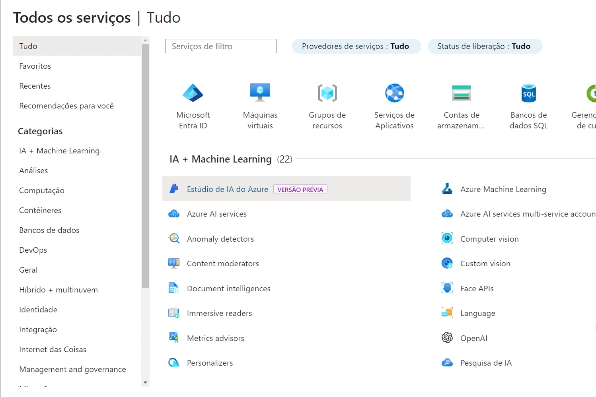

## Crei um nova máquina 

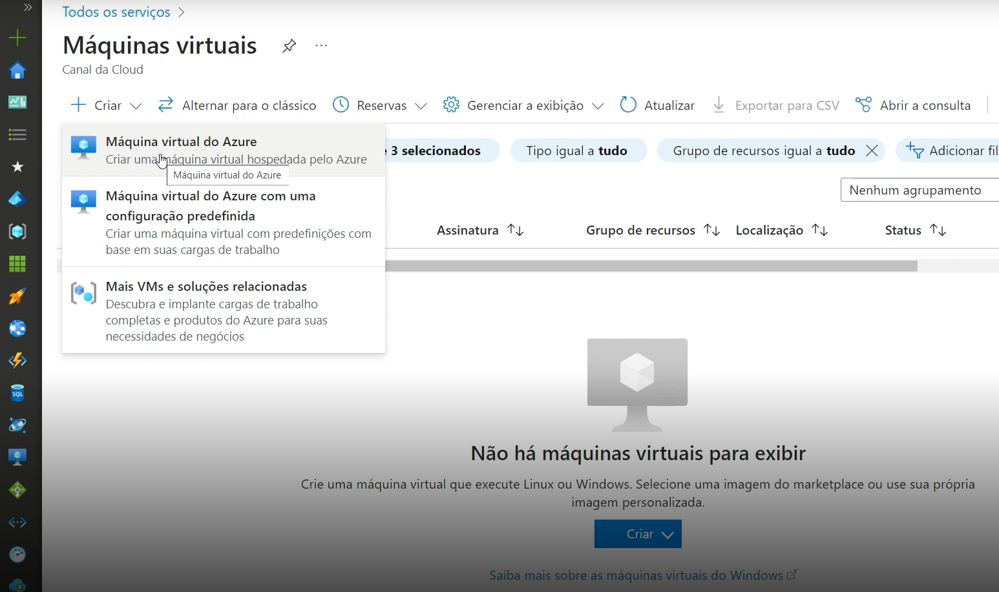

## Preencha os campos 

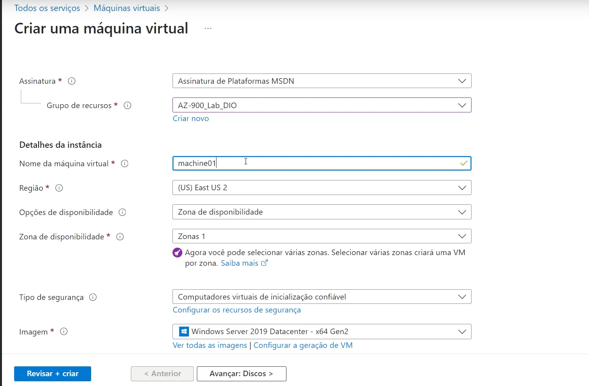

### Opções de diponibilidade 

- Zona de disponibilidade: separe fisicamente seus recursos em uma região do Azure
- Conjunto de dimensionamento de máquinas virtuais: Distribua as VMs entre zonas e domínios de falha em escala 
- Conjunto de disponibilidade: Distribua suas VMs automaticamente entre vários domínios de falha

## Familias de VMs

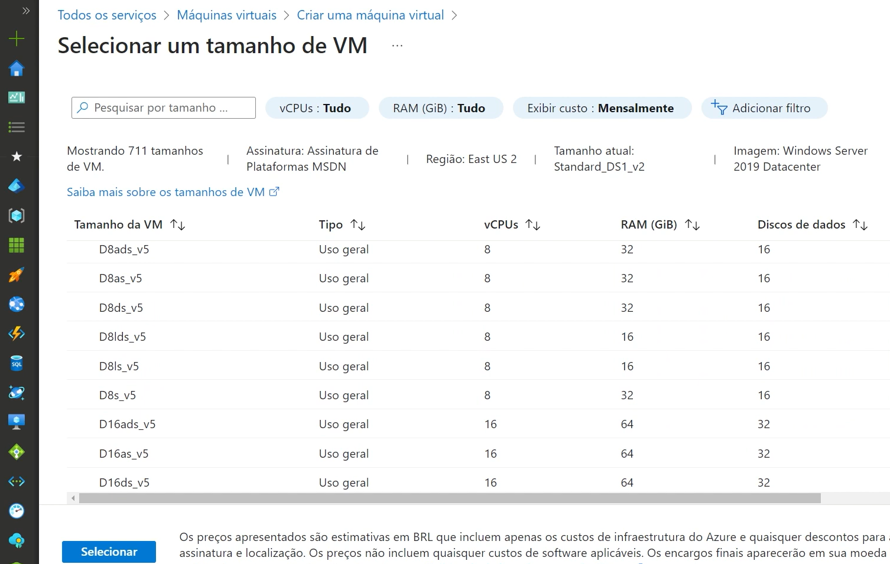

## Discos de SO

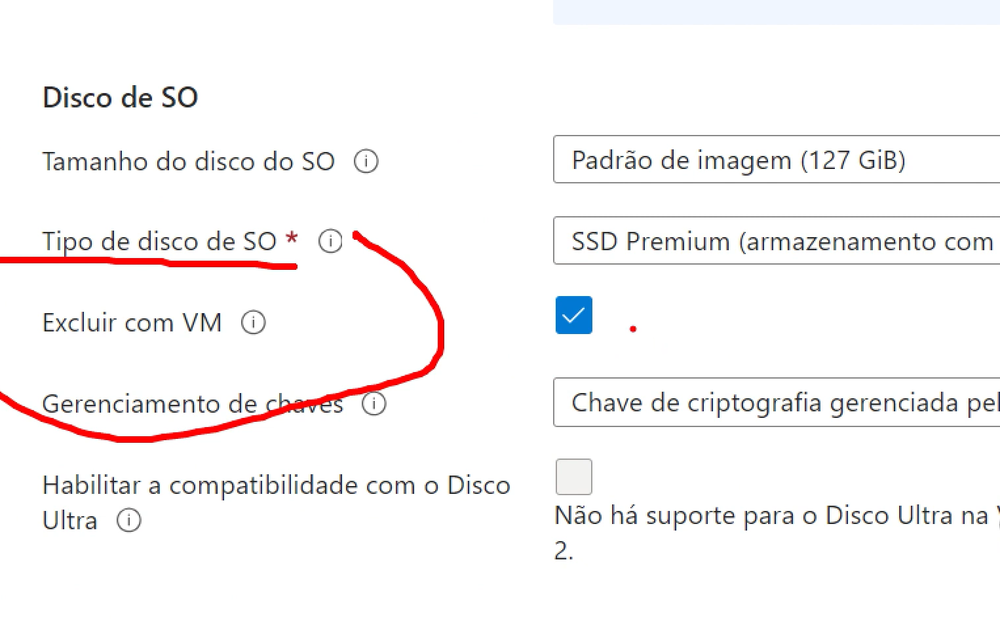

- Dica: deixe sempre a opção de `Excluir com VM` para os discos serm excluidos com as VMS
- Marque esse opção para evitar cobranças desencessaria
  
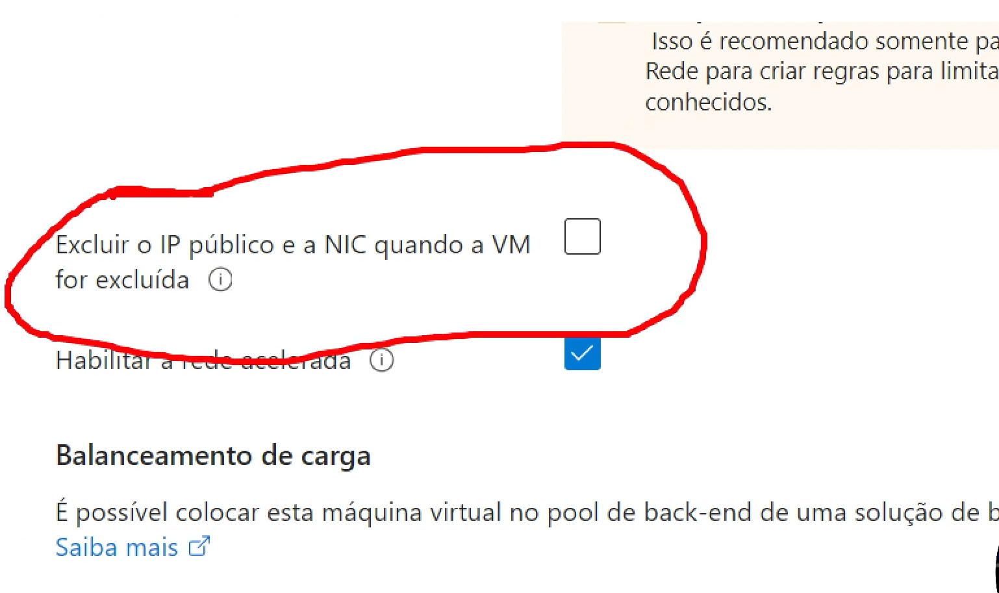

## Habilitar Backup

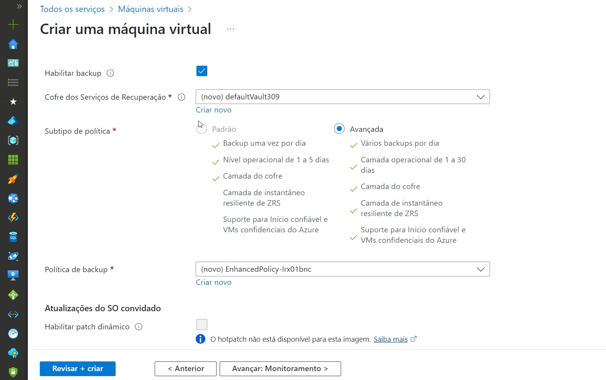

## Monitoramento

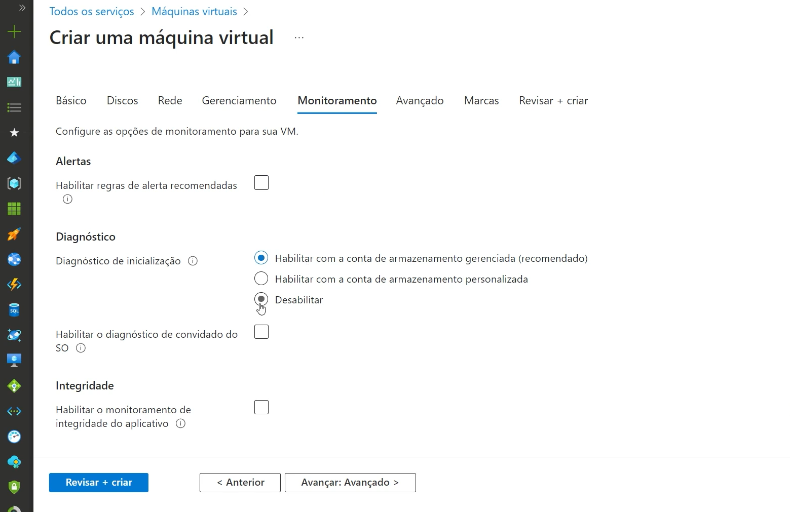

## Área de Trabalho virtual do Azure

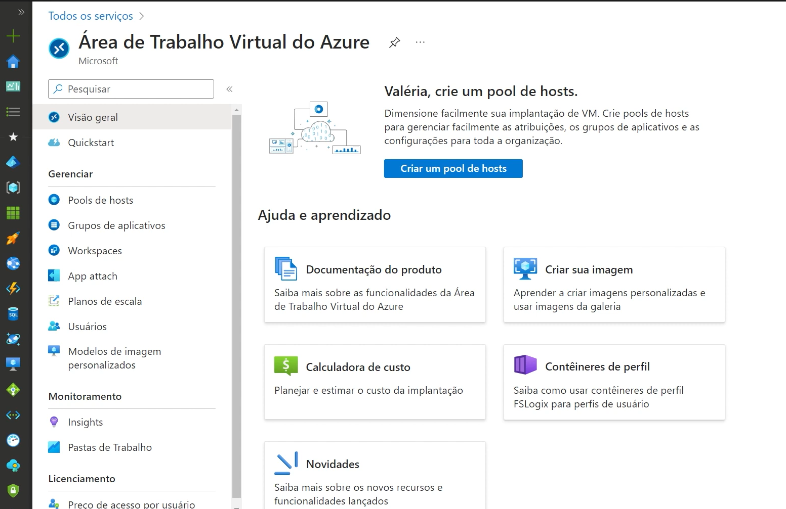

## Aplicativo de funções

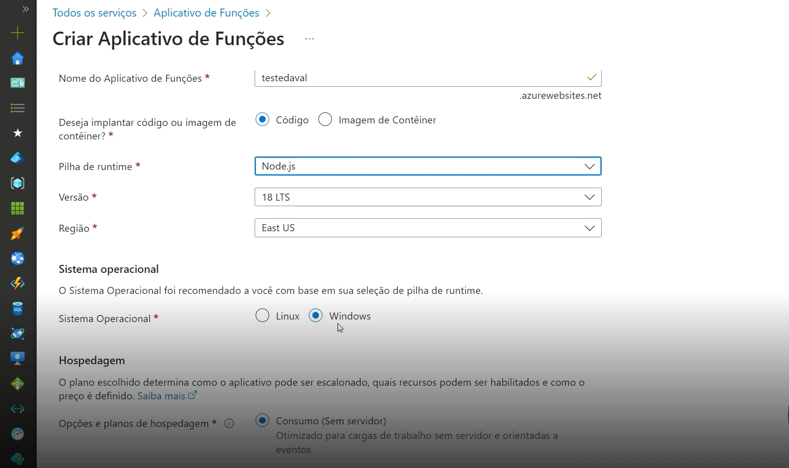

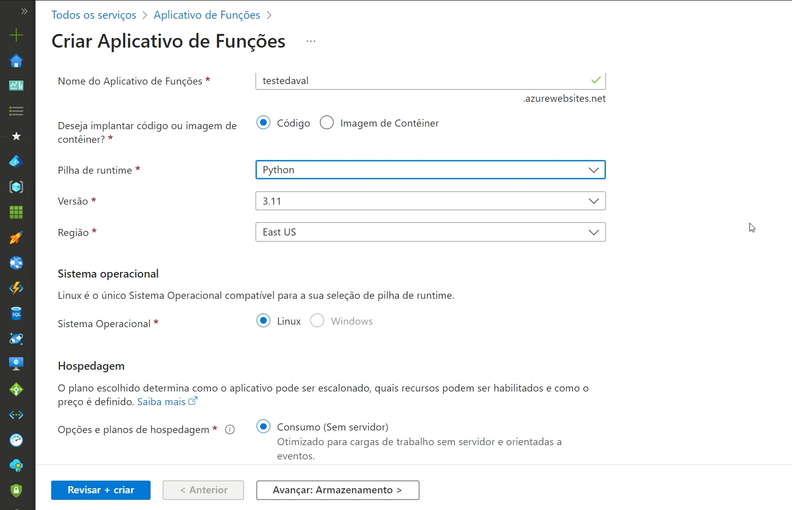