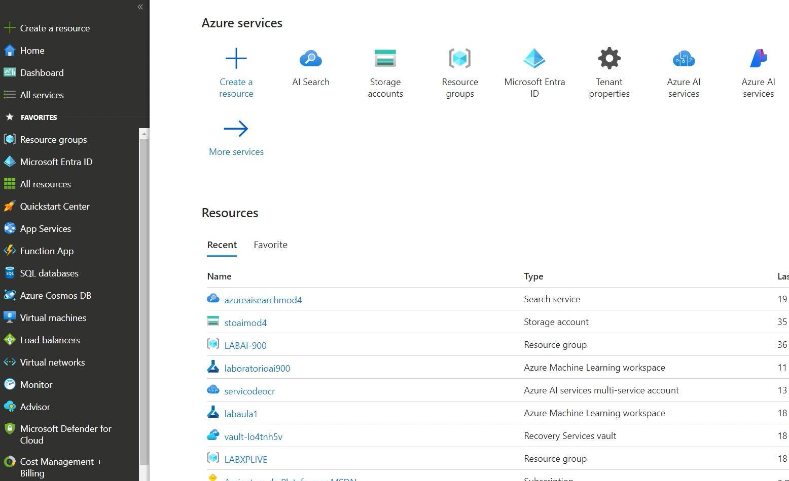
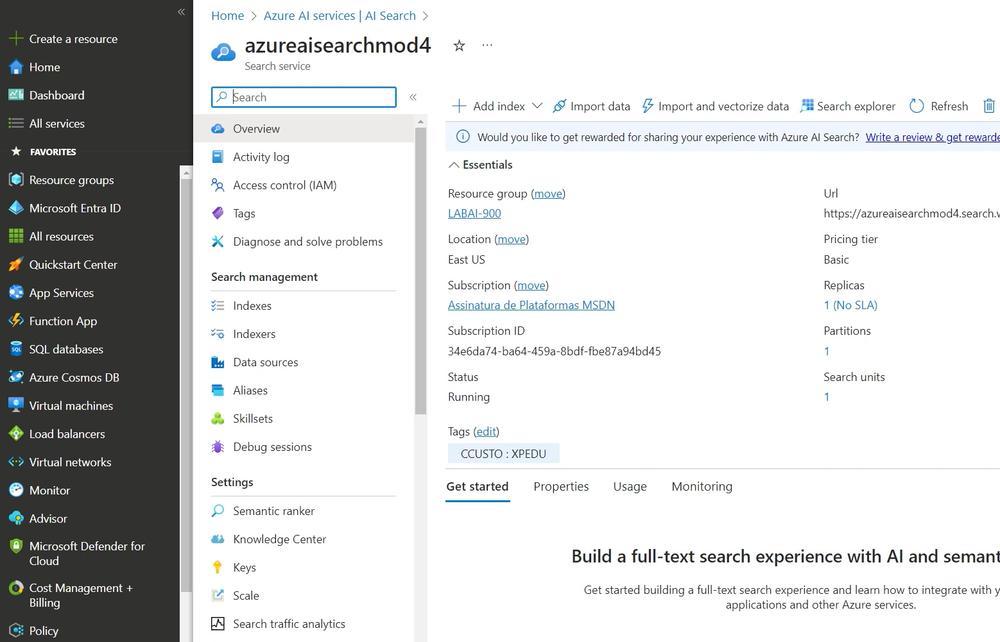
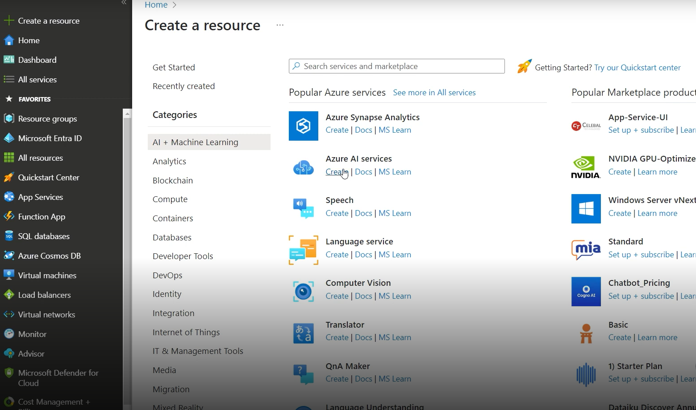
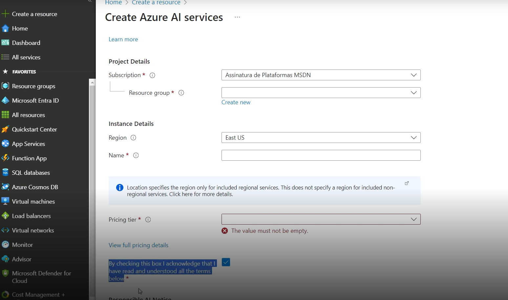
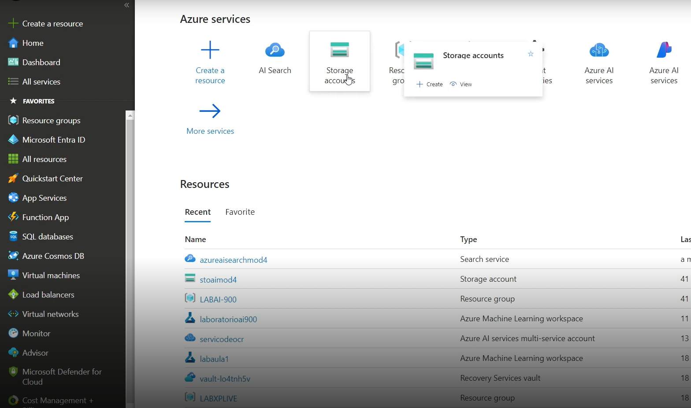
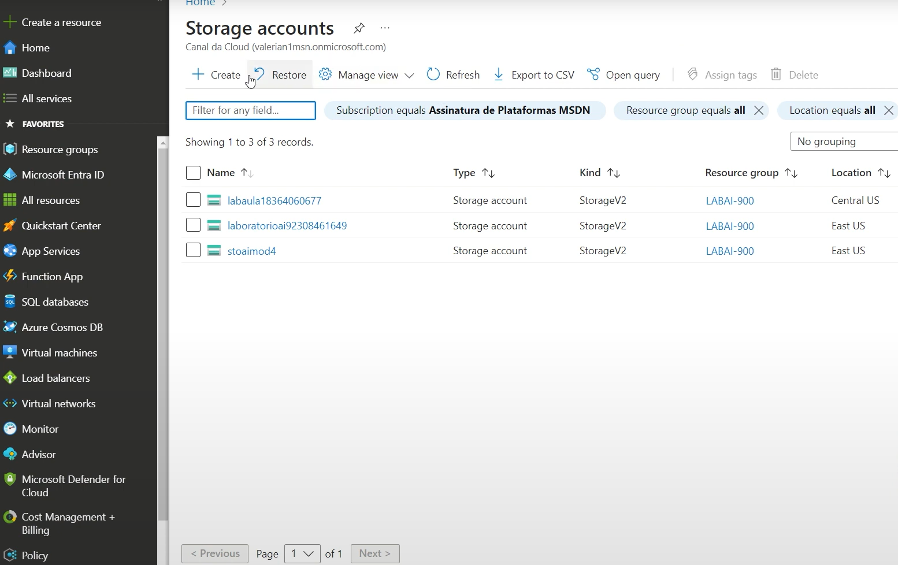
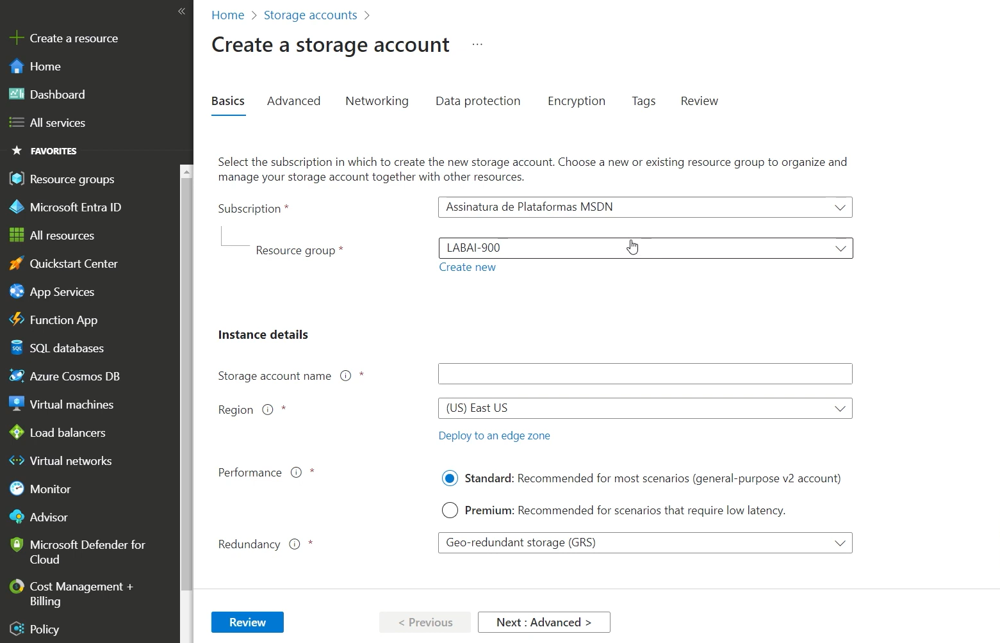
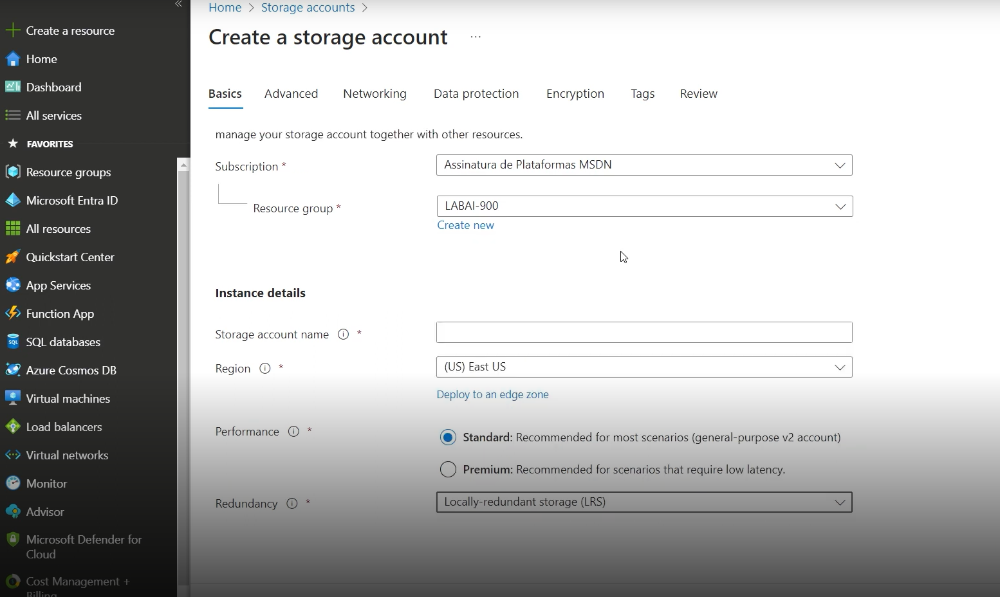
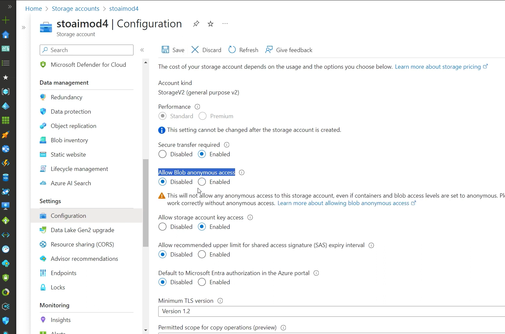
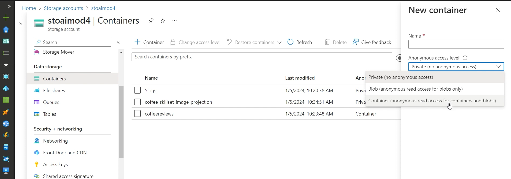

<a href="https://aka.ms/ai900-ai-search">Portal</a>

# Como fazer isso?

Clique em AI Search, caso não tenha um criado.

Criar um recurso de IA, clique em Create a resource. E clique em create onde está o curso do mause.

# Criando uma Conta de armazenamento

Clique em criar 

